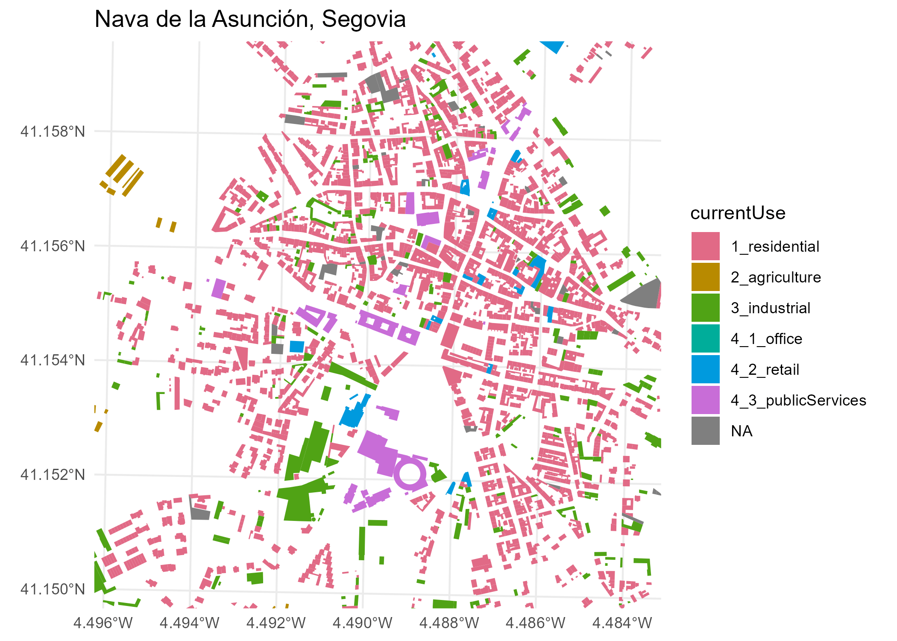
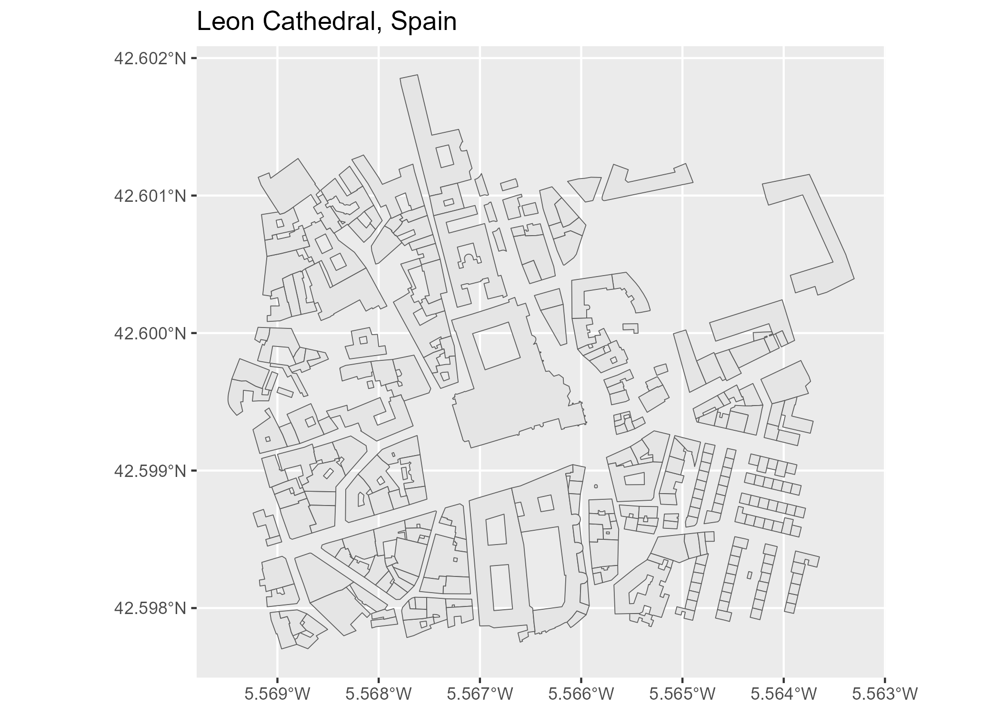

<!-- README.md is generated from README.Rmd. Please edit that file -->

# CatastRo <a href="https://ropenspain.github.io/CatastRo/"></a>

<!-- badges: start -->

[](https://ropenspain.es/)
[](https://CRAN.R-project.org/package=CatastRo)
[](https://cran.r-project.org/web/checks/check_results_CatastRo.html)
[](https://CRAN.R-project.org/package=CatastRo)
[](https://ropenspain.r-universe.dev/)
[](https://github.com/rOpenSpain/CatastRo/actions?query=workflow%3AR-CMD-check)
[](https://app.codecov.io/gh/rOpenSpain/CatastRo)
[](https://doi.org/10.5281/zenodo.6044091)
[](https://www.repostatus.org/#active)

<!-- badges: end -->

**CatastRo** is a package that provide access to different API services
of the [Spanish Cadastre](https://www.sedecatastro.gob.es/). With
**CatastRo** it is possible to download spatial objects (as buildings or
cadastral parcels), maps and geocode cadastral references.

## Installation

Install **CatastRo** from
[**CRAN**](https://CRAN.R-project.org/package=CatastRo):

``` r
install.packages("CatastRo")
```

You can install the developing version of **CatastRo** using the
[r-universe](https://ropenspain.r-universe.dev/ui#builds):

``` r
# Enable this universe
options(repos = c(
  ropenspain = "https://ropenspain.r-universe.dev",
  CRAN = "https://cloud.r-project.org"
))
install.packages("CatastRo")
```

Alternatively, you can install the developing version of **CatastRo**
with:

``` r
library(remotes)
install_github("rOpenSpain/CatastRo", dependencies = TRUE)
```

## Package API

The functions of **CatastRo** are organized by API endpoint. The package
naming convention is `catr_*api*_*description*`.

### OVCCoordenadas

These functions allow to geocode and reverse geocode cadastral
references using the
[OVCCoordenadas](https://ovc.catastro.meh.es/ovcservweb/OVCSWLocalizacionRC/OVCCoordenadas.asmx)
service.

These functions are named `catr_ovc_get_*` and returns a tibble, as
provided by the package **tibble**. See `vignette("ovcservice")`, where
these functions are described.

### INSPIRE

These functions return spatial object (on the formats provided by the
**sf** or **terra** using the [Catastro
INSPIRE](https://www.catastro.minhap.es/webinspire/index.html) service.

Note that the coverage of this service is 95% of the Spanish territory,
excluding Basque Country and Navarre that have their own independent
cadastral offices.

There are three types of functions, each one querying a different
service:

#### ATOM service

The ATOM service allows to batch-download vector objects of different
cadastral elements for a specific municipality. The result is provided
as `sf` objects (See **sf** package).

These functions are named `catr_atom_get_xxx`.

#### WFS service

The WFS service allows to download vector objects of specific cadastral
elements. The result is provided as `sf` objects (See **sf** package).

Note that there are some limitations on the extension and number of
elements to query. For batch-downloading the ATOM service is preferred.

These functions are named `catr_wms_get_xxx`.

#### WMS service

This service allows to download georeferenced images of different
cadastral elements. The result is a raster on the format provides by
**terra**.

There is a single function for querying this service:
`catr_wms_get_layer()`.

#### Terms and conditions of use

Please check the [downloading
provisions](https://www.catastro.minhap.es/webinspire/documentos/Licencia.pdf)
of the service.

## Examples

This script highlights some features of **CatastRo** :

### Geocode a cadastral reference

``` r
library(CatastRo)

catr_ovc_get_cpmrc(rc = "13077A01800039")
#> # A tibble: 1 × 10
#>   xcoord ycoord refcat     address pc.pc1 pc.pc2 geo.xcen geo.ycen geo.srs ldt  
#>    <dbl>  <dbl> <chr>      <chr>   <chr>  <chr>  <chr>    <chr>    <chr>   <chr>
#> 1  -3.46   38.6 13077A018… DS DIS… 13077… 18000… -3.4575… 38.6184… EPSG:4… DS D…
```

### Extract a cadastral reference from a given set of coordinates

``` r
catr_ovc_get_rccoor(
  lat = 38.6196566583596,
  lon = -3.45624183836806,
  srs = "4230"
)
#> # A tibble: 1 × 8
#>   refcat         address           pc.pc1 pc.pc2 geo.xcen geo.ycen geo.srs ldt  
#>   <chr>          <chr>             <chr>  <chr>     <dbl>    <dbl> <chr>   <chr>
#> 1 13077A01800039 DS DISEMINADO  P… 13077… 18000…    -3.46     38.6 EPSG:4… DS D…
```

### Extract geometries using the ATOM service

``` r
bu <- catr_atom_get_buildings("Nava de la Asuncion", to = "Segovia")


# Map
library(ggplot2)

ggplot(bu) +
  geom_sf(aes(fill = currentUse), col = NA) +
  coord_sf(
    xlim = c(374500, 375500),
    ylim = c(4556500, 4557500)
  ) +
  scale_fill_manual(values = hcl.colors(6, "Dark 3")) +
  theme_minimal() +
  ggtitle("Nava de la Asunción, Segovia")
```



### Extract geometries using the WFS service

``` r
wfs_get_buildings <- catr_wfs_get_buildings_bbox(
  c(-5.567429, 42.598935, -5.565509, 42.600396),
  srs = 4326
)

# Map
ggplot(wfs_get_buildings) +
  geom_sf() +
  ggtitle("Leon Cathedral, Spain")
```



### Extract maps using the WMS service

``` r
wms_bu <- catr_wms_get_layer(wfs_get_buildings, bbox_expand = 0.2)

# Map
# Load tidyterra
library(tidyterra)
ggplot() +
  geom_spatraster_rgb(data = wms_bu) +
  geom_sf(data = wfs_get_buildings, fill = "red", alpha = 0.6)
```


## A note on caching

Some data sets and tiles may have a size larger than 50MB. You can use
**CatastRo** to create your own local repository at a given local
directory passing the following option:

``` r
catr_set_cache_dir("./path/to/location")
```

When this option is set, **CatastRo** would look for the cached file and
it will load it, speeding up the process.

## Citation

To cite ‘CatastRo’ in publications use:

Delgado Panadero Á, Hernangómez D (2022). *CatastRo: Interface to the
API Sede Electrónica Del Catastro*. <doi:10.5281/zenodo.6044091>
<https://doi.org/10.5281/zenodo.6044091>,
<https://ropenspain.github.io/CatastRo/>.

A BibTeX entry for LaTeX users is:

    @Manual{R-catastro,
      title = {{CatastRo}: Interface to the {API} Sede Electrónica Del Catastro},
      author = {Ángel {Delgado Panadero} and Diego Hernangómez},
      year = {2022},
      version = {0.2.1.9000},
      url = {https://ropenspain.github.io/CatastRo/},
      doi = {10.5281/zenodo.6044091},
      abstract = {Access public spatial data available under the 'INSPIRE' directive. Tools for downloading references and addresses of properties, as well as map images.},
    }

## Contribute

Check the GitHub page for [source
code](https://github.com/ropenspain/CatastRo/).
