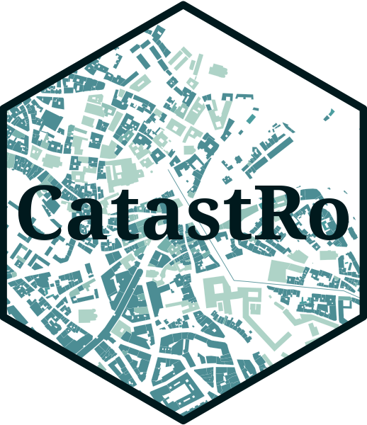

<!-- README.md is generated from README.qmd. Please edit that file -->

# CatastRo <a href="https://ropenspain.github.io/CatastRo/"></a>

<!-- badges: start -->

[](https://ropenspain.es/)
[](https://CRAN.R-project.org/package=CatastRo)
[](https://cran.r-project.org/web/checks/check_results_CatastRo.html)
[](https://CRAN.R-project.org/package=CatastRo)
[](https://ropenspain.r-universe.dev/CatastRo)
[](https://github.com/rOpenSpain/CatastRo/actions/workflows/roscron-check-standard.yaml)
[](https://app.codecov.io/gh/rOpenSpain/CatastRo)
[](https://doi.org/10.32614/CRAN.package.CatastRo)
[](https://www.repostatus.org/#active)

<!-- badges: end -->

**CatastRo** is a package that provides access to different API services of the
[Spanish Cadastre](https://www.sedecatastro.gob.es/). With **CatastRo**, you can
download spatial objects such as buildings, cadastral parcels, maps, and geocode
cadastral references.

## Installation

::: pkgdown-release
Install **CatastRo** from
[**CRAN**](https://CRAN.R-project.org/package=CatastRo):

```{r}
#| eval: false
install.packages("CatastRo")
```
:::

::: pkgdown-devel
Check the docs of the developing version in
<https://ropenspain.github.io/CatastRo/dev/>.

You can install the developing version of **CatastRo** using the
[r-universe](https://ropenspain.r-universe.dev/CatastRo):

```{r}
#| eval: false
# Install CatastRo in R:
install.packages(
  "CatastRo",
  repos = c(
    "https://ropenspain.r-universe.dev",
    "https://cloud.r-project.org"
  )
)
```

Alternatively, you can install the development version of **CatastRo** with:

```{r}
#| eval: false
pak::pak("rOpenSpain/CatastRo")
```
:::

## SSL issues

The SSL certificate of the Spanish Cadastre presents some issues that may cause
an error when using **CatastRo** (especially on macOS, see issue
[#40](https://github.com/rOpenSpain/CatastRo/issues/40)):

In **CatastRo \>= 1.0.0** you can try to fix it by running this line in your
session right after you start using the package: \`

```{r}
#| eval: false
# Disable SSL verification
options(catastro_ssl_verify = 0)
```

If you wish to make this setup persistent, write the same code in your
[`.Rprofile`](https://docs.posit.co/ide/user/ide/guide/environments/r/managing-r.html):

```{r}
#| eval: false
# Open your .Rprofile with
usethis::edit_r_profile()

# And write on that file:
options(catastro_ssl_verify = 0)
```

## Package API

The functions of **CatastRo** are organised by API endpoint. The package naming
convention is `catr_*api*_*description*`.

### OVCCoordenadas

These functions allow geocoding and reverse geocoding of cadastral references
using the
[OVCCoordenadas](https://ovc.catastro.meh.es/ovcservweb/OVCSWLocalizacionRC/OVCCoordenadas.asmx)
service.

These functions are named `catr_ovc_get_*` and return a tibble, as provided by
the package **tibble**. See `vignette("ovcservice", package = "CatastRo")` where
these functions are described.

### INSPIRE

These functions return spatial objects in the formats provided by the **sf** or
**terra** packages using the [Catastro
INSPIRE](https://www.catastro.hacienda.gob.es/webinspire/index.html) service.

Note that the coverage of this service is 95% of the Spanish territory,
excluding the Basque Country and Navarre[^1], which have their own independent
cadastral offices.

There are three types of functions, each one querying a different service:

#### ATOM service

The ATOM service allows batch-downloading vector objects of different cadastral
elements for a specific municipality. The result is provided as `sf` objects
(See **sf** package).

These functions are named `catr_atom_get_xxx`.

#### WFS service

The WFS service allows downloading vector objects of specific cadastral
elements. The results are provided as `sf` class objects (see the
[**sf**](https://r-spatial.github.io/sf/) package). Note that there are some
limitations on the extent and number of elements to query. For batch downloading
the ATOM service is preferred.

These functions are named `catr_wfs_get_xxx`.

#### WMS service

This service allows downloading georeferenced images of different cadastral
elements. The results are provided as rasters in the format provided by the
[**terra**](https://rspatial.github.io/terra/reference/terra-package.html)
package.

There is a single function for querying this service: `catr_wms_get_layer()`.

#### Terms and conditions of use

Please check the service's [downloading
provisions](https://www.catastro.hacienda.gob.es/webinspire/documentos/Licencia.pdf).

## Examples

This script highlights some features of **CatastRo**:

### Geocode a cadastral reference

```{r}
library(CatastRo)

catr_ovc_get_cpmrc(rc = "13077A01800039")
```

### Extract a cadastral reference from a given set of coordinates

```{r}
catr_ovc_get_rccoor(
  lat = 38.6196566583596,
  lon = -3.45624183836806,
  srs = "4230"
)
```

### Extract geometries using the ATOM service

```{r}
#| label: atom
#| fig-cap: Extracting buildings in Nava de la Asuncion with the ATOM service
bu <- catr_atom_get_buildings("Nava de la Asuncion", to = "Segovia")

# Map
library(ggplot2)

ggplot(bu) +
  geom_sf(aes(fill = currentUse), col = NA) +
  coord_sf(
    xlim = c(374500, 375500),
    ylim = c(4556500, 4557500)
  ) +
  scale_fill_manual(values = hcl.colors(6, "Dark 3")) +
  theme_minimal() +
  labs(title = "Nava de la Asunción, Segovia")
```

### Extract geometries using the WFS service

```{r}
#| label: wfs
#| fig-cap: Extract Alcázar of Segovia with the WFS service
wfs_get_buildings <- catr_wfs_get_buildings_bbox(
  c(-4.134, 40.952, -4.131, 40.953),
  srs = 4326
)

# Map
ggplot(wfs_get_buildings) +
  geom_sf() +
  labs(title = "Alcázar of Segovia, Segovia, Spain")
```

## A note on caching

Some datasets and tiles may have a size larger than 50MB. You can use
**CatastRo** to create your own local repository at a given local directory
passing the following option:

```{r}
#| eval: false
catr_set_cache_dir("./path/to/location")
```

When this option is set, **CatastRo** will look for the cached file and load it,
speeding up the process.

## Citation

```{r}
#| echo: false
#| results: asis
print(citation("CatastRo"), style = "html")
```

A BibTeX entry for LaTeX users is:

```{r}
#| echo: false
#| comment: ''
toBibtex(citation("CatastRo"))
```

## Contribute

Check the GitHub page for the [source
code](https://github.com/ropenspain/CatastRo/).

[^1]: The package [**CatastRoNav**](https://ropenspain.github.io/CatastRoNav/)
    provides access to the Cadastre of Navarre, with similar functionalities to
    **CatastRo**.
