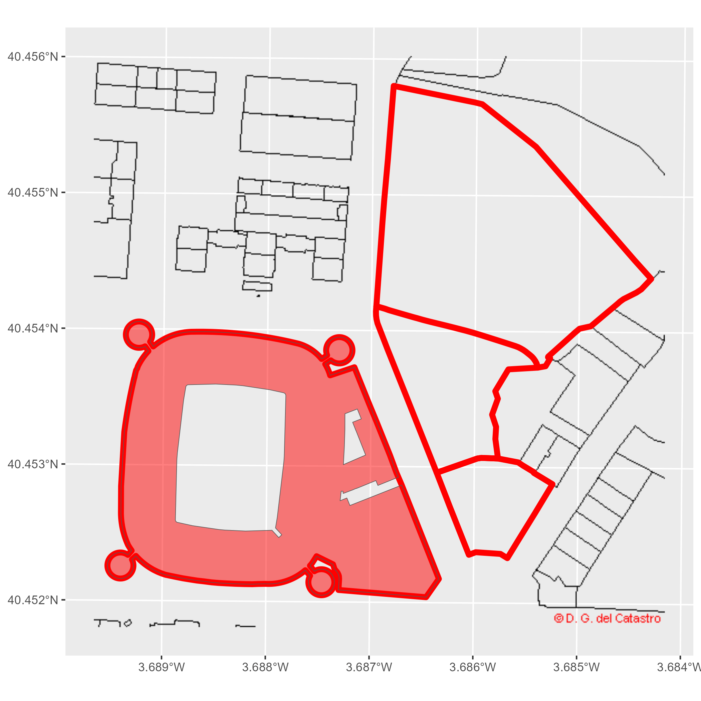
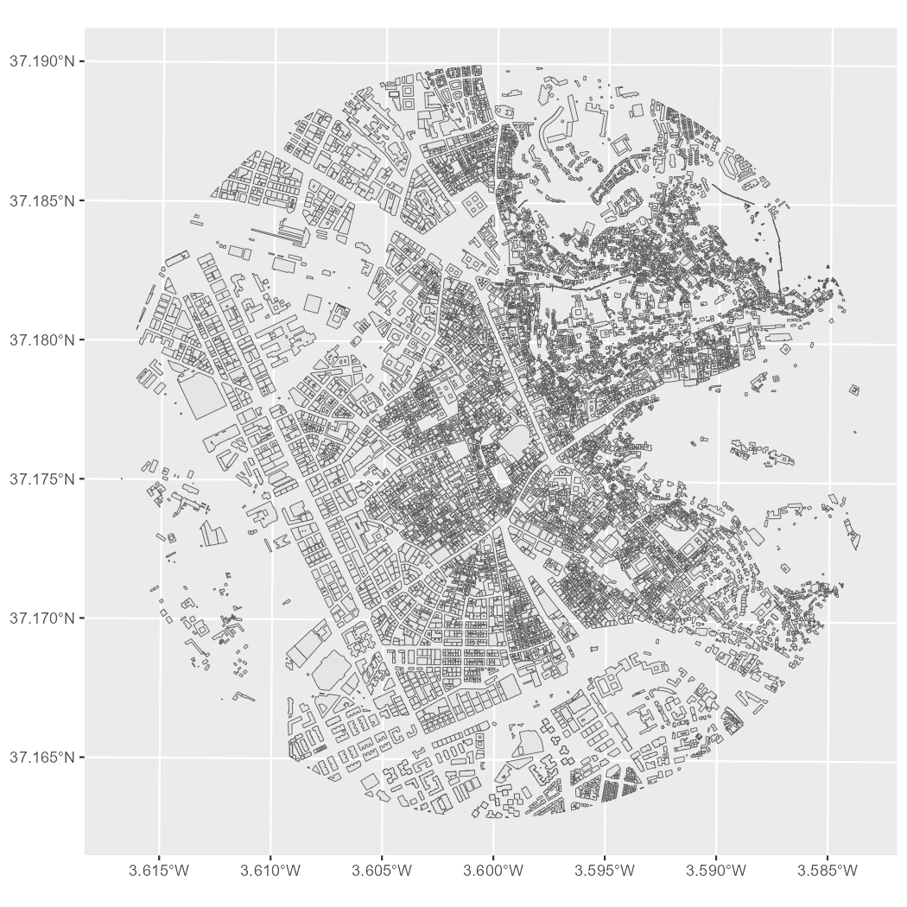
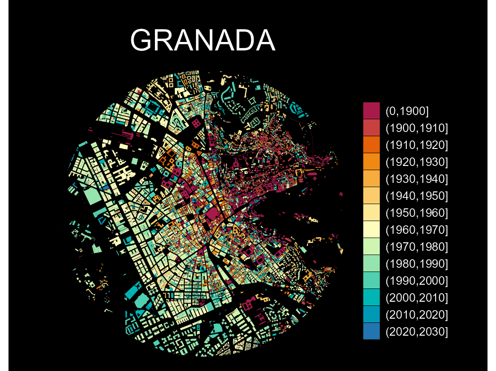

# Get started

**CatastRo** provides access to services from the [Spanish
Cadastre](https://www.sedecatastro.gob.es/). With **CatastRo**, you can
retrieve addresses, buildings, cadastral parcels and georeferenced map
images.

## OVCCoordenadas service

The
[OVCCoordenadas](https://ovc.catastro.meh.es/ovcservweb/OVCSWLocalizacionRC/OVCCoordenadas.asmx)
service retrieves the coordinates of a known cadastral reference
(geocoding). It can also retrieve cadastral references near a pair of
coordinates (reverse geocoding). **CatastRo** returns the results as
tibbles. These operations are described in detail in the corresponding
vignette (see
[`vignette("ovcservice", package = "CatastRo")`](https://ropenspain.github.io/CatastRo/dev/articles/ovcservice.md)).

## INSPIRE services

> The INSPIRE Directive aims to create a European Union Spatial Data
> Infrastructure (SDI) for the purposes of EU environmental policies and
> policies or activities which may have an impact on the environment.
> This European Spatial Data Infrastructure enables the sharing of
> environmental spatial information among public sector organizations,
> facilitates public access to spatial information across Europe and
> assists in policy-making across boundaries.

Source: [INSPIRE Knowledge
Base](https://knowledge-base.inspire.ec.europa.eu/overview_en)

The Spanish Cadastre implementation of the INSPIRE directive (see
[Spanish Cadastre INSPIRE
services](https://www.catastro.hacienda.gob.es/webinspire/index.html))
provides access to spatial objects from the cadastral database:

- **Vector objects:** Parcels, addresses, buildings, cadastral zones and
  more. **CatastRo** returns these objects as `sf` objects, using the
  **sf** package.
- **Imagery:** Image layers representing the same information as the
  vector objects. **CatastRo** returns these objects as `SpatRaster`
  objects, using the **terra** package.

Note that these services cover 95% of the Spanish territory, excluding
the Basque Country and Navarre[^1], which have their own independent
cadastral offices.

There are three INSPIRE services:

1.  **ATOM service:** The ATOM service downloads complete municipal
    datasets for different cadastral elements.

2.  **WFS service:** The WFS service downloads vector objects for
    specific cadastral elements. Note that there are restrictions on the
    extent and number of elements that can be queried. For full
    municipal downloads, prefer the ATOM service.

3.  **WMS service:** The WMS service downloads georeferenced map images
    for different cadastral elements.

## Examples

### Working with layers

This example demonstrates some of the main capabilities of the package
by recreating a cadastral map of the surroundings of the [Santiago
Bernabéu
Stadium](https://en.wikipedia.org/wiki/Santiago_Bernab%C3%A9u_Stadium).
We use the WMS and WFS services to retrieve different layers.

``` r

# Extract buildings by bounding box.
# Check https://boundingbox.klokantech.com/

library(CatastRo)

stadium <- catr_wfs_get_buildings_bbox(
  c(-3.6891446916, 40.4523311971, -3.687462138, 40.4538643165),
  srs = 4326
)

# Extract cadastral parcels using a spatial object as the query input.

stadium_parcel <- catr_wfs_get_parcels_bbox(stadium)

# Transform to the tile CRS.

stadium_parcel_pr <- sf::st_transform(stadium_parcel, 25830)

# Extract parcel label imagery.

labs <- catr_wms_get_layer(
  stadium_parcel_pr,
  what = "parcel",
  styles = "BoundariesOnly",
  srs = 25830
)

# Plot.
library(ggplot2)
library(tidyterra) # Plot SpatRaster layers.

ggplot() +
  geom_spatraster_rgb(data = labs) +
  geom_sf(
    data = stadium_parcel_pr,
    fill = NA, col = "red", linewidth = 2
  ) +
  geom_sf(data = stadium, fill = "red", alpha = .5) +
  coord_sf(crs = 25830)
```



Figure 1: Santiago Bernabéu example

### Thematic maps

We can also create thematic maps from attributes in the spatial objects.
This example visualizes the urban growth of Granada with **CatastRo**,
reproducing a map by [Dominic Royé](https://dominicroye.github.io)
([Royé 2019](#ref-roye19)) with the ATOM service.

First, we retrieve the geometry of Granada’s city center with
**mapSpain**:

``` r

library(dplyr)
library(sf)
library(mapSpain)

# Use esp_get_capimun() to get the city geometry.

city <- esp_get_capimun(munic = "^Granada$")
```

Next, we use
[`catr_get_code_from_coords()`](https://ropenspain.github.io/CatastRo/dev/reference/catr_get_code_from_coords.md)
to identify Granada’s cadastral municipality code, then download its
buildings with
[`catr_atom_get_buildings()`](https://ropenspain.github.io/CatastRo/dev/reference/catr_atom_get_buildings.md).

``` r

city_catr_code <- catr_get_code_from_coords(city)

city_catr_code
#> # A tibble: 1 × 12
#>   munic   catr_to catr_munic catrcode cpro  cmun  inecode nm      cd    cmc   cp    cm   
#>   <chr>   <chr>   <chr>      <chr>    <chr> <chr> <chr>   <chr>   <chr> <chr> <chr> <chr>
#> 1 GRANADA 18      900        18900    18    087   18087   GRANADA 18    900   18    87

city_bu <- catr_atom_get_buildings(city_catr_code$catrcode)
```

Next, we limit the analysis to a circle with a radius of 1.5 km around
the city center:

``` r

buff <- city |>
  # Adjust CRS to 25830 for buildings.
  st_transform(st_crs(city_bu)) |>
  # Buffer.
  st_buffer(1500)

# Cut buildings.
dataviz <- st_intersection(city_bu, buff)

ggplot(dataviz) +
  geom_sf()
```



Figure 2: Minimal cadastral map of Granada

Next, we extract the construction year from the `beginning` column:

``` r

# Extract the first four positions.
year <- substr(dataviz$beginning, 1, 4)

# Replace entries that do not look like years with 0000.
year[!(year %in% 0:2500)] <- "0000"

# Convert to numeric.
year <- as.integer(year)

# Add a new column.
dataviz <- dataviz |>
  mutate(year = year)
```

Finally, we group the data by construction year and create the
visualization. The [`cut()`](https://rdrr.io/r/base/cut.html) function
creates classes for each decade from 1900 onward:

``` r

dataviz <- dataviz |>
  mutate(
    year_cat = cut(year, breaks = c(0, seq(1900, 2030, by = 10)), dig.lab = 4)
  )

ggplot(dataviz) +
  geom_sf(aes(fill = year_cat), color = NA, na.rm = TRUE) +
  scale_fill_manual(
    values = hcl.colors(15, "Spectral"),
    na.translate = FALSE
  ) +
  theme_void() +
  labs(title = "GRANADA", fill = "") +
  theme(
    panel.background = element_rect(fill = "black"),
    plot.background = element_rect(fill = "black"),
    legend.justification = .5,
    legend.text = element_text(
      colour = "white",
      size = 12
    ),
    plot.title = element_text(
      colour = "white",
      hjust = .5,
      margin = margin(t = 30),
      size = 30
    ),
    plot.caption = element_text(
      colour = "white",
      margin = margin(b = 20),
      hjust = .5
    ),
    plot.margin = margin(r = 40, l = 40)
  )
```



Figure 3: Granada - Urban growth

## References

Royé, Dominic. 2019. *Visualize Urban Growth*.
<https://dominicroye.github.io/blog/visualize-urban-growth/>.

[^1]: The package
    [**CatastRoNav**](https://ropenspain.github.io/CatastRoNav/)
    provides access to the Cadastre of Navarre, with similar
    functionality to **CatastRo**.
