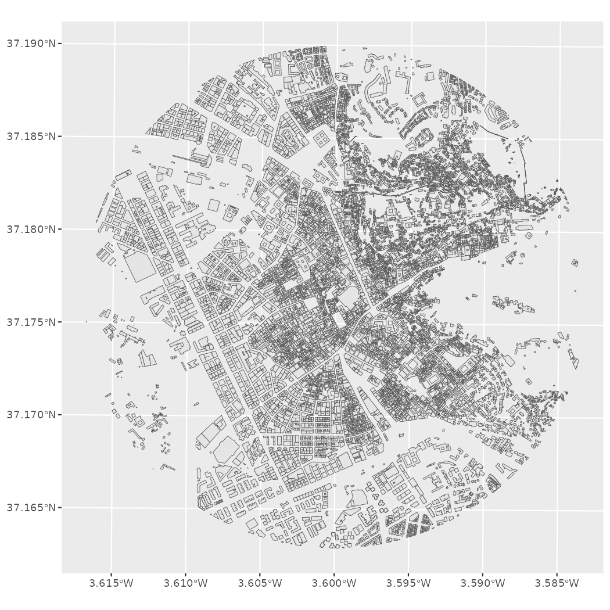
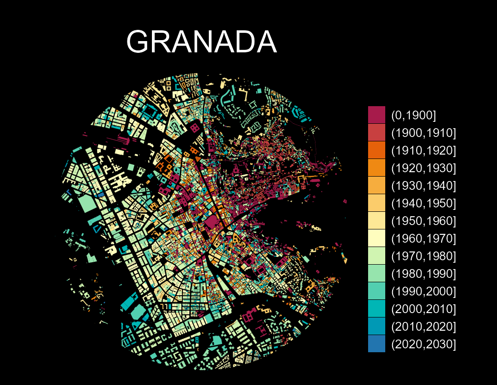

<!-- CatastRo.Rmd is generated from CatastRo.Rmd.orig. Please edit that file -->


**CatastRo** provides access to different API services of the [Spanish
Cadastre](https://www.sedecatastro.gob.es/). With **CatastRo** you can download
official information on addresses, properties, parcels, and buildings.

## OVCCoordenadas Service

The
[OVCCoordenadas](https://ovc.catastro.meh.es/ovcservweb/OVCSWLocalizacionRC/OVCCoordenadas.asmx)
service allows retrieving the coordinates of a known cadastral reference
(geocoding). It is also possible to retrieve the cadastral references around a
specific pair of coordinates (reverse geocoding). **CatastRo** returns the
results in a tibble format. This functionality is described in detail in the
corresponding vignette (see `vignette("ovcservice", package = "CatastRo")`).

## INSPIRE Services

> The INSPIRE Directive aims to create a European Union spatial data
> infrastructure for the purposes of EU environmental policies and policies or
> activities which may have an impact on the environment. This European Spatial
> Data Infrastructure will enable the sharing of environmental spatial
> information among public sector organisations, facilitate public access to
> spatial information across Europe and assist in policy-making across
> boundaries.
>
> _From <https://knowledge-base.inspire.ec.europa.eu/overview_en>_

The implementation of the INSPIRE directive on the Spanish Cadastre (see
[Catastro INSPIRE](https://www.catastro.hacienda.gob.es/webinspire/index.html))
allows retrieving spatial objects from the database of the cadastre:

- **Vector objects:** Parcels, addresses, buildings, cadastral zones and more.
  These objects are provided by **CatastRo** as `sf` objects as provided by
  the **sf** package.
- **Imagery:** Image layers representing the same information as the vector
  objects. These objects are provided by **CatastRo** as `SpatRaster` objects
  as provided by the **terra** package.

Note that **the coverage of this service is 95% of the Spanish territory**,
excluding the Basque Country and Navarre[^1] that have their own independent
cadastral offices.

There are three types of functions, each one querying a different service:

1.  **ATOM service**: The ATOM service allows batch-downloading vector objects
    of different cadastral elements for a specific municipality.

2.  **WFS service**: The WFS service allows downloading vector objects of
    specific cadastral elements. Note that there are some _restrictions on the
    extent and number of elements_ to query. For batch-downloading the ATOM
    service is preferred.

3.  **WMS service**: This service allows downloading georeferenced images of
    different cadastral elements.

## Examples

### Working with layers

In this example, we will demonstrate some of the main capabilities of the
package by recreating a cadastral map of the surroundings of the [Santiago
Bernabéu Stadium](https://en.wikipedia.org/wiki/Santiago_Bernab%C3%A9u_Stadium).
We will make use of the **WMS and WFS services** to get different layers in
order to show some of the capabilities of the package:


``` r
# Extract building by bounding box
# Check https://boundingbox.klokantech.com/

library(CatastRo)

stadium <- catr_wfs_get_buildings_bbox(
  c(-3.6891446916, 40.4523311971, -3.687462138, 40.4538643165),
  srs = 4326
)

# Now extract cadastral parcels. We can use spatial objects on the query

stadium_parcel <- catr_wfs_get_parcels_bbox(stadium)

# Project for tiles

stadium_parcel_pr <- sf::st_transform(stadium_parcel, 25830)

# Extract imagery: Labels of the parcel

labs <- catr_wms_get_layer(
  stadium_parcel_pr,
  what = "parcel",
  styles = "BoundariesOnly",
  srs = 25830
)

# Plot
library(ggplot2)
library(tidyterra) # For terra tiles

ggplot() +
  geom_spatraster_rgb(data = labs) +
  geom_sf(data = stadium_parcel_pr, fill = NA, col = "red", linewidth = 2) +
  geom_sf(data = stadium, fill = "red", alpha = .5) +
  coord_sf(crs = 25830)
```

<div class="figure">

<p class="caption">Example: Santiago Bernabeu</p>
</div>

### Thematic maps

We can also create thematic maps using the information available on the spatial
objects. We will produce a visualization of the urban growth of Granada using
**CatastRo**, replicating the map produced by [Dominic
Royé](https://dominicroye.github.io) [@roye19], using the **ATOM service**.

First, we extract the coordinates of the city center of Granada using
**mapSpain**:


``` r
library(dplyr)
library(sf)
library(mapSpain)

# Use mapSpain for getting the coords

city <- esp_get_capimun(munic = "^Granada$")
```

The next step consists of extracting the buildings using the ATOM service. We
will also use the function `catr_get_code_from_coords()` to identify the code of
Granada in the Cadastre, and we will download the buildings with
`catr_atom_get_buildings()`.


``` r
city_catr_code <- catr_get_code_from_coords(city)

city_catr_code
#> # A tibble: 1 × 12
#>   munic   catr_to catr_munic catrcode cpro  cmun  inecode nm      cd    cmc   cp    cm
#>   <chr>   <chr>   <chr>      <chr>    <chr> <chr> <chr>   <chr>   <chr> <chr> <chr> <chr>
#> 1 GRANADA 18      900        18900    18    087   18087   GRANADA 18    900   18    87

city_bu <- catr_atom_get_buildings(city_catr_code$catrcode)
```

The next step in creating the visualization is to limit the analysis to a circle
of radius 1.5 km around the city center:


``` r
buff <- city %>%
  # Adjust CRS to 25830: (Buildings)
  st_transform(st_crs(city_bu)) %>%
  # Buffer
  st_buffer(1500)


# Cut buildings

dataviz <- st_intersection(city_bu, buff)

ggplot(dataviz) +
  geom_sf()
```

<div class="figure">

<p class="caption">Minimal cadastral map of Granada</p>
</div>

Now let's extract the construction year, available in the column `beginning`:


``` r
# Extract 4 initial positions
year <- substr(dataviz$beginning, 1, 4)

# Replace all that doesn't look as a number with 0000
year[!(year %in% 0:2500)] <- "0000"


# To numeric
year <- as.integer(year)

# New column
dataviz <- dataviz %>%
  mutate(year = year)
```

The last step is to create groups based on the year and create the data
visualization. Here we use the function `cut()` to create classes for every
decade starting from year 1900:


``` r
dataviz <- dataviz %>%
  mutate(
    year_cat = cut(year, breaks = c(0, seq(1900, 2030, by = 10)), dig.lab = 4)
  )


ggplot(dataviz) +
  geom_sf(aes(fill = year_cat), color = NA, na.rm = TRUE) +
  scale_fill_manual(
    values = hcl.colors(15, "Spectral"),
    na.translate = FALSE
  ) +
  theme_void() +
  labs(title = "GRANADA", fill = "") +
  theme(
    panel.background = element_rect(fill = "black"),
    plot.background = element_rect(fill = "black"),
    legend.justification = .5,
    legend.text = element_text(
      colour = "white",
      size = 12
    ),
    plot.title = element_text(
      colour = "white",
      hjust = .5,
      margin = margin(t = 30),
      size = 30
    ),
    plot.caption = element_text(
      colour = "white",
      margin = margin(b = 20),
      hjust = .5
    ),
    plot.margin = margin(r = 40, l = 40)
  )
```

<div class="figure">

<p class="caption">Granada: Urban growth</p>
</div>

## References

[^1]:
    The package [**CatastRoNav**](https://ropenspain.github.io/CatastRoNav/)
    provides access to the Cadastre of Navarre, with similar functionalities to
    **CatastRo**.
