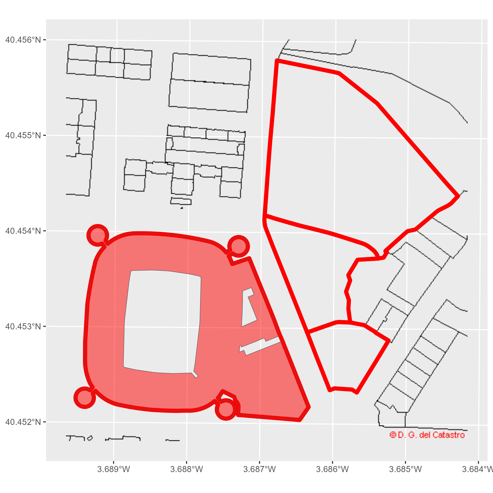

<!-- CatastRo.Rmd is generated from CatastRo.Rmd.orig. Please edit that file -->


**CatastRo** provide access to different API services of the [Spanish
Cadastre](https://www.sedecatastro.gob.es/). With **CatastRo** it is possible to
download official information of addresses, properties, parcels and buildings.

## OVCCoordenadas Service

The
[OVCCoordenadas](https://ovc.catastro.meh.es/ovcservweb/OVCSWLocalizacionRC/OVCCoordenadas.asmx)
service allows to retrieve the coordinates of a known cadastral reference
(geocoding). It is also possible to retrieve the cadastral references around a
specific pair of coordinates (reverse geocoding). **CatastRo** returns the
results on a tibble format (see `vignette("tibble", package = "tibble")`). This
functionality is described in detail in the corresponding vignette (see
`vignette("ovcservice")`).

## INSPIRE Services

> The INSPIRE Directive aims to create a European Union spatial data
> infrastructure for the purposes of EU environmental policies and policies or
> activities which may have an impact on the environment. This European Spatial
> Data Infrastructure will enable the sharing of environmental spatial
> information among public sector organisations, facilitate public access to
> spatial information across Europe and assist in policy-making across
> boundaries.
>
> *From <https://knowledge-base.inspire.ec.europa.eu/overview_en>*

The implementation of the INSPIRE directive on the Spanish Cadastre (see
[Catastro INSPIRE](https://www.catastro.minhap.es/webinspire/index.html)) allows
to retrieve spatial objects from the database of the cadastre:

-   **Vector objects:** Parcels, addresses, buildings, cadastral zones and more.
    These objects are provided by **CatastRo** as *sf* objects (see `?sf)`.

-   **Imagery:** Image layers representing the same information than the vector
    objects. These objects are provided by **CatastRo** as *SpatRaster* objects
    (see `?terra)`.

Note that **the coverage of this service is 95% of the Spanish territory**,
excluding Basque Country and Navarre that have their own independent cadastral
offices.

There are three types of functions, each one querying a different service:

1.  **ATOM service**: The ATOM service allows to batch-download vector objects
    of different cadastral elements for a specific municipality.

2.  **WFS service**: The WFS service allows to download vector objects of
    specific cadastral elements.Note that there are some *restrictions on the
    extension and number of elements* to query. For batch-downloading the ATOM
    service is preferred.

3.  **WMS service**: This service allows to download georeferenced images of
    different cadastral elements.

## Examples

### Working with layers

On this example we would demonstrate some of the main capabilities of the
package by recreating a cadastral map of the surroundings of the [Santiago
Bernabéu Stadium](https://en.wikipedia.org/wiki/Santiago_Bernab%C3%A9u_Stadium).
We would make use of the **WMS and WFS services** to get different layers in
order to show some of the capabilities of the package:


```r
# Extract building by bounding box
# Check https://boundingbox.klokantech.com/

library(CatastRo)

stadium <- catr_wfs_get_buildings_bbox(
  c(-3.6891446916, 40.4523311971, -3.687462138, 40.4538643165),
  srs = 4326
)

# Now extract cadastral parcels. We can use spatial objects on the query

stadium_parcel <- catr_wfs_get_parcels_bbox(stadium)

# Project for tiles

stadium_parcel_pr <- sf::st_transform(stadium_parcel, 25830)

# Extract imagery: Labels of the parcel

labs <- catr_wms_get_layer(stadium_parcel_pr,
  what = "parcel",
  styles = "BoundariesOnly",
  srs = 25830
)

# Plot
library(ggplot2)
library(tidyterra) # For terra tiles

ggplot() +
  geom_spatraster_rgb(data = labs) +
  geom_sf(data = stadium_parcel_pr, fill = NA, col = "red", linewidth = 2) +
  geom_sf(data = stadium, fill = "red", alpha = .5) +
  coord_sf(crs = 25830)
```

<div class="figure">

<p class="caption">Example: Santiago Bernabeu</p>
</div>

### Thematic maps

We can create also thematic maps using the information available on the spatial
objects. We would produce a visualization of the urban growth of Valencia using
**CatastRo**, replicating the map produced by Dominic Royé on his post
[Visualize urban
growth](https://dominicroye.github.io/en/2019/visualize-urban-growth/), using
the **ATOM services**.

In first place, we extract the coordinates of the city center of Valencia using
**mapSpain**:


```r
library(dplyr)
library(sf)
library(mapSpain)

# Use mapSpain for getting the coords

val <- esp_get_capimun(munic = "^València$")
```

Next step consists on extracting the buildings using the ATOM service. We would
use also the function `catr_get_code_from_coords()` to identify the code of
Valencia in the Cadastre, and we would download the buildings with
`catr_atom_get_buildings()`.


```r
val_catr_code <- catr_get_code_from_coords(val)

val_catr_code
#> # A tibble: 1 × 12
#>   munic  catr_to catr_munic catrcode cpro  cmun  inecode nm    cd    cmc   cp   
#>   <chr>  <chr>   <chr>      <chr>    <chr> <chr> <chr>   <chr> <chr> <chr> <chr>
#> 1 VALEN… 46      900        46900    46    250   46250   VALE… 46    900   46   
#> # ℹ 1 more variable: cm <chr>

valencia_bu <- catr_atom_get_buildings(val_catr_code$catrcode)
#> Error in catr_hlp_dwnload(api_entry, filename, cache_dir, verbose, update_cache, : 
#> Execution halted
```

Next step for creating the visualization is to limit the analysis to a circle of
radius 2.5 km around the city center:


```r
buff <- val %>%
  # Adjust CRS to 25830: (Buildings)
  st_transform(st_crs(valencia_bu)) %>%
  # Buffer
  st_buffer(2500)
#> Error: object 'valencia_bu' not found


# Cut buildings

dataviz <- st_intersection(valencia_bu, buff)
#> Error in eval(expr, envir, enclos): object 'valencia_bu' not found

ggplot(dataviz) +
  geom_sf()
#> Error in eval(expr, envir, enclos): object 'dataviz' not found
```

Let's extract now the construction year, available in the column `beginning`:


```r
# Extract 4 initial positions
year <- substr(dataviz$beginning, 1, 4)
#> Error in eval(expr, envir, enclos): object 'dataviz' not found

# Replace all that doesn't look as a number with 0000
year[!(year %in% 0:2500)] <- "0000"
#> Error: object 'year' not found

# To numeric
year <- as.integer(year)
#> Error in eval(expr, envir, enclos): object 'year' not found

# New column
dataviz <- dataviz %>%
  mutate(year = year)
#> Error in eval(expr, envir, enclos): object 'dataviz' not found
```

Last step is to create groups based on the year and create the data
visualization. We use here the function `ggplot2::cut_number()` to create 15
different classes:


```r
dataviz <- dataviz %>%
  mutate(year_cat = ggplot2::cut_number(year,
    n = 15
  ))
#> Error in eval(expr, envir, enclos): object 'dataviz' not found


ggplot(dataviz) +
  geom_sf(aes(fill = year_cat), color = NA) +
  scale_fill_manual(values = hcl.colors(15, "Spectral")) +
  theme_void() +
  labs(title = "VALÈNCIA", fill = "") +
  theme(
    panel.background = element_rect(fill = "black"),
    plot.background = element_rect(fill = "black"),
    legend.justification = .5,
    legend.text = element_text(
      colour = "white",
      size = 12
    ),
    plot.title = element_text(
      colour = "white", hjust = .5,
      margin = margin(t = 30),
      size = 30
    ),
    plot.caption = element_text(
      colour = "white",
      margin = margin(b = 20), hjust = .5
    ),
    plot.margin = margin(r = 40, l = 40)
  )
#> Error in eval(expr, envir, enclos): object 'dataviz' not found
```

## References

- Royé D (2019). "Visualize urban growth." <https://dominicroye.github.io/en/2019/visualize-urban-growth/>.
